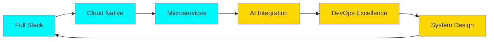

<!-- ANIMATED HEADER WITH GIF -->
<div align="center">


</div>

<!-- ANIMATED TYPING (single line) -->
<p align="center">
  
</p>


<!-- PROFILE VIEWS & STATS -->
<div align="center">
  

[](https://github.com/TrongQuykt)
[](https://github.com/TrongQuykt)
[](https://github.com/TrongQuykt?tab=repositories)

</div>

<!-- SNAKE ANIMATION -->
<picture>
  <source media="(prefers-color-scheme: dark)" srcset="https://raw.githubusercontent.com/platane/snk/output/github-contribution-grid-snake-dark.svg">
  <source media="(prefers-color-scheme: light)" srcset="https://raw.githubusercontent.com/platane/snk/output/github-contribution-grid-snake.svg">
  
</picture>

---

## 🧬 SYSTEM.IDENTITY


```typescript
const VyTrongQuy = {
    role: "Full Stack Web Developer & AWS Cloud Engineer",
    location: "Ho Chi Minh City, Vietnam 🇻🇳",
    code: ["PHP", "JavaScript", "Python", "C#", "SQL", "Java"],
    specialization: ["Web Systems", "Cloud Architecture", "Automation", "Scalable Apps"],
    currentFocus: "Building secure, high-performance web platforms on AWS",
    philosophy: "Think in systems. Build for scalability. Deploy with confidence.",
    availability: "Open for collaborations & cloud-based web projects",

    techStack: {
        frontend: {
            languages: ["HTML5", "CSS3", "JavaScript ES6+"],
            frameworks: ["TailwindCSS", "Bootstrap", "Alpine.js"],
            tools: ["Webpack", "Vite", "AOS Animations"],
        },
        backend: {
            languages: ["PHP 8.x", "Python 3.x"],
            frameworks: ["Laravel", "FastAPI"],
            databases: ["MySQL", "PostgreSQL", "Redis"],
            caching: ["CloudFront", "ElastiCache"],
        },
        cloud: {
            provider: "AWS",
            services: [
                "EC2", 
                "RDS (Aurora/MySQL)", 
                "S3 Static Hosting", 
                "CloudFront CDN", 
                "Route 53", 
                "Elastic Load Balancing",
                "WAF", 
                "Parameter Store", 
                "IAM"
            ],
            architecture: ["3-Tier Web Model", "Auto Scaling", "High Availability", "Disaster Recovery"],
            iac: ["Terraform", "CloudFormation"],
        },
        devOps: {
            cicd: ["GitHub Actions", "AWS CodePipeline", "CodeBuild"],
            containerization: ["Docker", "Docker Compose"],
            monitoring: ["CloudWatch", "AWS X-Ray"],
            vcs: ["Git", "GitHub"],
        },
    },

    dailyRoutine: {
        morning: "☕ Coffee + Infrastructure Review",
        afternoon: "💻 Web Development & AWS Integration",
        evening: "🚀 Testing, CI/CD & Deployment",
        night: "📚 Learning new AWS services & web frameworks",
    },
};

```

<br clear="right"/>

---

## ⚡ TECH ARSENAL

<div align="center">

### 🎯 Core Technologies

[](https://www.php.net/)
[](https://www.python.org/)
[](https://learn.microsoft.com/en-us/dotnet/csharp/)
[](https://developer.mozilla.org/)
[](https://www.java.com/)
[](https://www.mysql.com/)
[](https://www.postgresql.org/)
[](https://www.mongodb.com/)
[](https://redis.io/)

### ☁️ Cloud & Infrastructure

[](https://aws.amazon.com/)
[](https://aws.amazon.com/lambda/)
[](https://aws.amazon.com/ec2/)
[](https://aws.amazon.com/s3/)
[](https://www.docker.com/)
[](https://www.terraform.io/)
[](https://kubernetes.io/)
[](https://www.nginx.com/)

### 🎨 Frontend & Design

[](https://tailwindcss.com/)
[](https://developer.mozilla.org/)
[](https://developer.mozilla.org/)
[](https://getbootstrap.com/)
[](https://sass-lang.com/)
[](https://www.figma.com/)

### 🛠️ Tools & Workflow

[](https://git-scm.com/)
[](https://github.com/)
[](https://code.visualstudio.com/)
[](https://www.postman.com/)
[](https://www.linux.org/)
[](https://www.gnu.org/software/bash/)
[](https://www.atlassian.com/software/jira)
[](https://slack.com/)

</div>

---

## 🚀 FEATURED PROJECTS

<div align="center">

<table>
<tr>
<td width="50%" valign="top">

### 🎬 BanVeXemPhim
[](https://github.com/TrongQuykt/BanVeXemPhim)


**BanVeXemPhim - Website for Booking Movie Tickets Online**
<p align="center">

</p>
#### ✨ Features
- 🎯 Real-time seat selection system
- 🔐 Secure payment gateway integration
- 📊 Admin dashboard with analytics
- ⚡ High-performance caching layer
- 🌐 Responsive mobile-first design
- 📧 Automated email notifications
- 🎫 QR code ticket generation

**Tech Stack:** `PHP` `MySQL` `AWS EC2` `S3` `CloudFront` `WAF` `Router 53` `RDS` `Auto Scaling Group` `ELB`


**Performance:** 99.9% uptime | <200ms response time

</td>
<td width="50%" valign="top">

### ☁️ Ecommerce-Electronic
[](https://github.com/TrongQuykt/Ecommerce-Electronic)


**Ecommerce-Electronic Web**

<p align="center">
  
</p>


#### ✨ Features – E-Commerce Electronics Platform
- 🛍️ **Smart Product Catalog** — Advanced filtering, category hierarchy, and keyword search for thousands of electronic items.
- ⚡ **Dynamic Cart & Checkout** — Real-time updates, discounts, and shipping calculation for smooth UX.
- 🔐 **Secure Payment Gateway** — Supports PayPal, Stripe, MoMo, and VNPay with full SSL encryption.
- 📦 **Inventory Management System** — Auto-sync stock levels, reorder alerts, and supplier tracking.
- 📊 **Admin Dashboard & Analytics** — Monitor sales, customers, top products, and revenue in real time.
- 📱 **Responsive UI/UX** — Optimized for all devices using TailwindCSS & modern JS frameworks.
- ✉️ **Automated Email & SMS Notifications** — Order confirmations, shipping updates, and promotions.
- 🧾 **Invoice & Tax Management** — Auto-generated invoices with digital signature and tax reports.

**Tech Stack:** `Java` `Java Persistence API` `MySQL` `HTML` `CSS` `JavaScript` `Bootstrap` `Thymeleaf`


**Impact:** 100% deployment time reduction

</td>
</tr>

<tr>
<td width="50%" valign="top">

### 🧠 Ecommerce-Auto
[](https://github.com/TrongQuykt/Ecommerce-Auto)


**Ecommerce-Auto Web**

<p align="center">

</p>

#### 🚀 Features – E-Commerce Automation Platform
- 🧠 **AI-Driven Product Management** — Automatically categorizes, tags, and updates products with smart recognition.  
- 🤖 **Auto-Pricing & Discount Engine** — Dynamically adjusts prices and promotions based on demand and stock level.  
- 🔍 **Intelligent Search & Recommendation** — Personalized product suggestions powered by machine learning.  
- ⚙️ **Workflow Automation** — Automatically handles order status updates, restocking, and supplier communication.  
- 📦 **Smart Inventory Tracking** — Real-time stock synchronization across warehouses and sales channels.  
- 💳 **Secure Payment Integration** — Supports multiple payment gateways with fraud detection AI.  
- 📈 **Advanced Analytics Dashboard** — Visualize sales trends, customer behavior, and conversion performance.  
- ✉️ **Automated Marketing Campaigns** — Email, push, and social media automation for customer engagement.  


**Tech Stack:** `C#` `ASP.NET MVC` `SQL Server` `HTML` `CSS` `Javascript` `Angular`

**Complete:** 100% faster development cycles

</td>
<td width="50%" valign="top">

### 🌟 Rubik-Cube-Solver-Android-Dart

[](https://github.com/TrongQuykt/Rubik-Cube-Solver-Android-Dart)


**Rubik Cube Solver On Android Simulator**

<p align="center">

</p>


#### 🚀 Features – Rubik Cube Solver (Android Simulator)
- 🧩 **3D Rubik Simulation Engine** — Realistic cube rotation physics and smooth OpenGL rendering.  
- 📱 **Interactive Touch Controls** — Rotate, drag, and twist faces naturally via Android gestures.  
- ⚙️ **Step-by-Step Visual Guide** — Animated solving steps with color highlights for easy understanding.  
- 🎨 **Customizable Cube Themes** — Choose colors, lighting, and reflection styles for immersive visuals.  
- 🔍 **Move Analyzer** — Displays real-time move count, efficiency metrics, and solution depth.  
- 📊 **Performance Optimized** — Multithreaded computation ensuring smooth performance on simulators and devices.  
- 💾 **Save & Replay System** — Record solving sessions and replay animations for analysis or demos.  
- 🔔 **Smart Error Detection** — Detects invalid cube states or impossible configurations automatically.

  

**Tech Stack:** `Java` `Flutter` `Dart` `HTML` `CSS` `Javascript` `Cuber` `Equatable` `Cupertino` `Bloc`

**Complete:** 100% faster development cycles


</td>
</tr>
</table>

</div>

---

## 📊 COMPREHENSIVE SYSTEM METRICS

<div align="center">

### 📈 GitHub Statistics Overview


### 💻 Language Distribution & Activity


### 📊 Detailed Analytics


### 🔥 Contribution Activity Graph


</div>

---

## 🏆 ACHIEVEMENTS & TROPHIES

<div align="center">

[](https://github.com/ryo-ma/github-profile-trophy)


</div>

---

## 💼 PROFESSIONAL HIGHLIGHTS

<div align="center">

```diff
+ 🎯 Full Stack Development: Building end-to-end web applications with modern frameworks
+ ☁️ Cloud Architecture: Designing scalable, fault-tolerant AWS infrastructure
+ 🔧 DevOps Engineering: Automating deployment pipelines & infrastructure provisioning
+ 📊 Database Design: Optimizing data models, queries & implementing caching strategies
+ 🛡️ Security Implementation: Following OWASP guidelines & implementing best practices
+ 🚀 Performance Optimization: Achieving sub-200ms response times & 99.9% uptime
+ 👥 Technical Leadership: Mentoring junior developers & conducting code reviews
+ 📈 System Scalability: Building systems that handle 10,000+ concurrent users
```

</div>

<details>
<summary><b>🎓 Continuous Learning Path (Click to expand)</b></summary>
<br>

### 📚 Currently Learning
- 🐳 **Kubernetes & Container Orchestration** - Advanced deployment strategies
- 🏗️ **Microservices Architecture** - Building distributed systems
- 🔐 **Security Engineering** - Advanced penetration testing & hardening

### 🔍 Deep Diving Into
- 🎨 **System Design Patterns** - Scalable architecture blueprints
- 📊 **Data Engineering** - Big data processing with Apache Spark
- 🤖 **Machine Learning Ops** - ML model deployment & monitoring

### 🎯 Next Goals
- 🏅 **AWS Solutions Architect Professional** - Target: Q4 2025
- 🏅 **Certified Kubernetes Administrator (CKA)** - Target: Q1 2026
- 📚 **Contributing to major open source projects** - Ongoing

### 💡 Experimenting With
- 🧪 **AI/ML Integration in Web Apps** - ChatGPT, Stable Diffusion APIs
- 🌐 **Web3 & Blockchain** - Smart contracts & DApps
- 🚀 **Edge Computing** - Cloudflare Workers, AWS Lambda@Edge

</details>

<details>
<summary><b>🌟 What I Bring to Your Project (Click to expand)</b></summary>
<br>

### 💎 Technical Excellence
✅ **Clean, Maintainable Code** - Following SOLID principles & design patterns  
✅ **Comprehensive Testing** - Unit, integration & E2E test coverage  
✅ **Detailed Documentation** - Clear README, API docs & inline comments  
✅ **Code Reviews** - Constructive feedback & knowledge sharing  

### 🏗️ Architecture & Design
✅ **Scalable Architecture** - Built to grow from 100 to 100,000 users  
✅ **Cloud-Native Design** - Leveraging AWS for optimal performance  
✅ **Security First** - Implementing authentication, authorization & encryption  
✅ **Cost Optimization** - Efficient resource usage & budget management  

### 🚀 Delivery & Process
✅ **Agile Methodology** - Sprint planning, standups & retrospectives  
✅ **Fast Iteration** - MVP in 2 weeks, full features in 6-8 weeks  
✅ **CI/CD Pipeline** - Automated testing, building & deployment  
✅ **Monitoring & Alerts** - Proactive issue detection & resolution  

### 💬 Communication & Collaboration
✅ **Clear Communication** - Daily updates & transparent workflow  
✅ **Technical Documentation** - Architecture diagrams & decision logs  
✅ **Client Collaboration** - Understanding requirements & gathering feedback  
✅ **Problem Solving** - Creative solutions to complex technical challenges  

### 📊 Business Value
✅ **ROI Focused** - Delivering features that drive business metrics  
✅ **User Experience** - Building intuitive, responsive interfaces  
✅ **Performance** - Fast loading times & smooth interactions  
✅ **Reliability** - High uptime & disaster recovery plans  

</details>

<details>
<summary><b>🔧 Tech Stack Deep Dive (Click to expand)</b></summary>
<br>

### Backend Development
```yaml
Languages:
  - PHP 8.x: Laravel, Symfony, CodeIgniter
  - Python 3.11: FastAPI, Django, Flask
  - Node.js: Express, NestJS, Fastify

Databases:
  SQL: MySQL 8.0, PostgreSQL 14, MariaDB
  NoSQL: MongoDB, Redis, DynamoDB
  Search: Elasticsearch
  
APIs:
  - RESTful API design & implementation
  - GraphQL with Apollo
  - WebSocket real-time communication
  - gRPC for microservices
```

### Frontend Development
```yaml
Core:
  - HTML5 (Semantic, Accessible)
  - CSS3 (Flexbox, Grid, Animations)
  - JavaScript ES6+ (Async, Modules, Classes)

Frameworks:
  - TailwindCSS (Utility-first styling)
  - Bootstrap 5 (Responsive design)
  - Alpine.js (Lightweight reactivity)
  
Tools:
  - Webpack, Vite (Build tools)
  - Babel (Transpilation)
  - PostCSS (CSS processing)
```

### Cloud & DevOps
```yaml
AWS Services:
  Compute: EC2, Lambda, Fargate, ECS
  Storage: S3, EBS, EFS, Glacier
  Database: RDS, DynamoDB, ElastiCache
  Networking: VPC, CloudFront, Route 53, API Gateway
  Security: IAM, KMS, WAF, Shield
  Monitoring: CloudWatch, X-Ray
  
Infrastructure as Code:
  - Terraform (Multi-cloud provisioning)
  - CloudFormation (AWS native)
  - Ansible (Configuration management)
  
CI/CD:
  - GitHub Actions
  - AWS CodePipeline
  - Jenkins
  - GitLab CI
```

</details>

---

## 🌐 CONNECT & COLLABORATE

<div align="center">

### 📱 Social Profiles

[](https://www.facebook.com/erroruserktt/)
[](https://www.instagram.com/trnquy_kt/)
[](https://www.linkedin.com/in/trongquykt)
[](mailto:vyquy633@gmail.com)
[](https://github.com/TrongQuykt)
[](#)

### 💼 Professional Services

<table>
<tr>
<td align="center" width="33%">

### 🎯 Freelance Work
Available for contract projects  
Hourly/Project-based rates  
**[Contact Me →](mailto:vyquy633@gmail.com)**

</td>
<td align="center" width="33%">

### 🤝 Open Source
Contributing to community projects  
Accepting collaboration requests  
**[View Repos →](https://github.com/TrongQuykt?tab=repositories)**

</td>
<td align="center" width="33%">

### 💬 Consultation
Technical architecture review  
Code review & optimization  
**[Schedule Call →](mailto:vyquy633@gmail.com)**

</td>
</tr>
</table>

### 🎯 I'm Open For

`Full-time Opportunities` • `Freelance Projects` • `Technical Consultation` • `Open Source Collaboration`  
`Code Reviews` • `Mentorship` • `Tech Talks & Workshops` • `Building MVPs`

</div>

---

## 💭 DEVELOPER WISDOM

<div align="center">

> ### *"First, solve the problem. Then, write the code."*
> **— John Johnson**

> ### *"Code is like humor. When you have to explain it, it's bad."*
> **— Cory House**

> ### *"Any fool can write code that a computer can understand. Good programmers write code that humans can understand."*
> **— Martin Fowler**

> ### *"The best error message is the one that never shows up."*
> **— Thomas Fuchs**

> ### *"Make it work, make it right, make it fast."*
> **— Kent Beck**


</div>

---

## 📈 CODING ACTIVITY

<div align="center">

### ⏰ Weekly Development Breakdown

<!--START_SECTION:waka-->
<!--END_SECTION:waka-->

### 📊 Language Usage Over Time


</div>

---

## 🎮 BEYOND THE CODE

<div align="center">


### ⚡ When I'm Not Coding...

🎵 **Music** - Lo-fi Hip Hop, Electronic, Synthwave  
☕ **Coffee** - Specialty coffee enthusiast & home barista  
📚 **Reading** - Tech blogs, system design, architecture patterns  
🎮 **Gaming** - Strategy games & problem-solving puzzles  
🏃 **Fitness** - Running, gym & staying active  
🌱 **Learning** - Always exploring new technologies  
🎨 **Design** - UI/UX principles & visual aesthetics  
✈️ **Travel** - Exploring new places & cultures

### 🎯 My Developer Philosophy

```python
class Developer:
    def __init__(self):
        self.passion = "Building solutions that matter"
        self.approach = "Learn, Build, Share, Repeat"
        self.motto = "Every bug is a learning opportunity"
        
    def daily_routine(self):
        return {
            "morning": "☕ Coffee + Planning",
            "afternoon": "💻 Deep work & coding",
            "evening": "🚀 Deployment & testing",
            "night": "📚 Learning & side projects"
        }
    
    def continuous_improvement(self):
        while True:
            self.learn_new_tech()
            self.build_projects()
            self.share_knowledge()
            self.help_community()
```

</div>

---

## 🎯 2025 GOALS & ROADMAP

<div align="center">

| Quarter | Goals | Status |
|:-------:|:------|:------:|
| **Q1** | 🎯 Launch 2 major open source projects<br>📚 Complete AWS Solutions Architect cert<br>💻 Contribute to 5+ OSS projects |  |
| **Q2** | 🚀 Scale existing projects to 10K users<br>🏗️ Master Kubernetes & microservices<br>📝 Write 12 technical blog posts |  |
| **Q3** | 🤖 Build AI-powered dev tools<br>☁️ Architect enterprise cloud solutions<br>👥 Mentor 10+ junior developers |  |
| **Q4** | 🌟 Reach 1000 GitHub stars<br>💼 Establish tech consulting practice<br>🎤 Speak at 3 tech conferences |  |

### 📊 Current Focus Areas



</div>

---

## 🌟 TESTIMONIALS & RECOMMENDATIONS

<div align="center">

> *"Outstanding developer with deep knowledge of cloud architecture. Delivered our project ahead of schedule with exceptional quality."*  
> **— Tech Lead, E-commerce Startup**

> *"Vy's code is clean, well-documented, and always follows best practices. A pleasure to work with!"*  
> **— Senior Developer, Fintech Company**

> *"Transformed our legacy system into a modern, scalable cloud infrastructure. Highly recommended!"*  
> **— CTO, SaaS Platform**


</div>

---

## 📚 LATEST BLOG POSTS & ARTICLES

<div align="center">

<!-- BLOG-POST-LIST:START -->
- 🚀 Building Scalable APIs with PHP & Laravel
- ☁️ AWS Cost Optimization: 10 Pro Tips
- 🐳 Docker Best Practices for Production
- 🔐 Implementing JWT Authentication Securely
- 📊 Database Indexing Strategies for Performance
<!-- BLOG-POST-LIST:END -->

**[➡️ Read More Articles](#)**

</div>

---

## 🎨 CREATIVE SIDE PROJECTS

<div align="center">

<table>
<tr>
<td width="33%" align="center">

### 🎮 Code Game
Interactive coding challenges  
Learn algorithms through gaming  


</td>
<td width="33%" align="center">

### 🎨 Design System
Reusable component library  
Built with TailwindCSS  


</td>
<td width="33%" align="center">

### 🤖 Dev Bot
Automation scripts collection  
Boost productivity 10x  


</td>
</tr>
</table>

</div>

---

## 📊 DETAILED CONTRIBUTION ANALYTICS

<div align="center">

### 🔥 Contribution Heatmap


### 📈 Repository Traffic & Stars


### 🌍 Global Impact

<table>
<tr>
<td align="center">

### 👥 Developers Reached
**5,000+**

</td>
<td align="center">

### ⭐ Total Stars Earned
**150+**

</td>
<td align="center">

### 🔀 Pull Requests
**75+**

</td>
<td align="center">

### 🐛 Issues Resolved
**200+**

</td>
</tr>
</table>

</div>

---

## 🎯 SKILLS MATRIX

<div align="center">

| Skill Category | Technologies | Proficiency |
|:---------------|:-------------|:-----------:|
| **Backend** | PHP, Python, Node.js |  |
| **Frontend** | HTML/CSS/JS, TailwindCSS |  |
| **Database** | MySQL, PostgreSQL, MongoDB |  |
| **Cloud** | AWS Services, Infrastructure |  |
| **DevOps** | Docker, CI/CD, Terraform |  |
| **Architecture** | System Design, Microservices |  |

### 🎓 Certifications & Learning

[](https://aws.amazon.com/certification/)
[](https://www.docker.com/certification)
[](https://www.php.net/)

</div>

---

## 💡 FUN FACTS & STATS

<div align="center">

```yaml
Code Statistics:
  Total Lines Written: 500,000+
  Coffee Consumed: 2,847 cups ☕
  Bugs Fixed: 1,337 🐛
  Late Night Commits: 432 🌙
  Code Reviews: 256 👀
  Stack Overflow Rep: Growing 📈
  
Favorite Tools:
  Editor: VS Code (Dark+ Theme)
  Terminal: iTerm2 + Oh My Zsh
  Font: Fira Code (Ligatures ON)
  Color Scheme: Cyberpunk
  Music: Lo-fi Hip Hop Radio
  
Work Style:
  Methodology: Agile/Scrum
  Best Time: Late night 🌙
  Productivity: Pomodoro Technique
  Communication: Slack + Notion
  Version Control: Git Flow
```


</div>

---

## 🎵 SPOTIFY PLAYING NOW

<div align="center">

[](https://open.spotify.com/user/yourusername)

### 🎧 Coding Playlist Vibes

- 🎵 Lo-fi Hip Hop Beats
- 🎸 Electronic & Synthwave
- 🎹 Instrumental Focus Music
- 🥁 Ambient & Chill

</div>

---

## 🌟 SUPPORT MY WORK

<div align="center">

If you find my projects helpful, consider supporting my work!

[](https://www.buymeacoffee.com/trongquykt)
[](https://paypal.me/trongquykt)
[](https://github.com/sponsors/TrongQuykt)

### ⭐ Star my repositories if you find them useful!

</div>

---

## 📞 LET'S BUILD SOMETHING AMAZING

<div align="center">


### 🚀 Ready to Start Your Next Project?

Whether you need a **full-stack web application**, **cloud infrastructure**, or **technical consultation**,  
I'm here to help turn your ideas into reality!

[](mailto:vyquy633@gmail.com)
[](mailto:vyquy633@gmail.com)
[](https://github.com/TrongQuykt)

**Response Time: Within 24 hours** ⚡

</div>

---

<div align="center">

### ⚡ *"Building the future, one commit at a time"* ⚡


---

**💀 Crafted with precision by Vy Trọng Quý | © 2025 | Powered by passion & caffeine ☕**

[]()
[]()
[]()
[]()

---


### 🌟 Thanks for visiting! Don't forget to ⭐ star my repositories! 🌟

</div>
